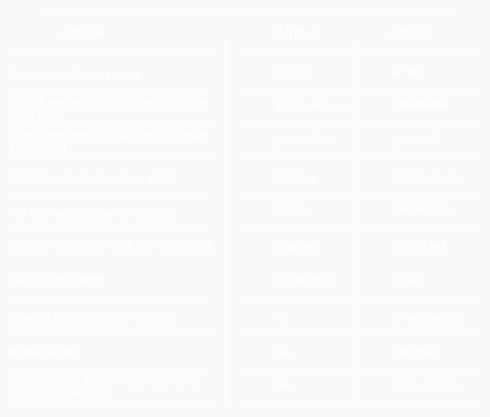

# JUNIT 4 vs JUNIT 5


- JUnit son versiyonu  JUnit5, Java8'in özelliklerini kullanarak daha okunabiilir, kullanışlı ve esnek bir framework ortaya koymaya çalışmıştır.
---
## Annotations


- @TestFactory : Metodun dinamik test olduğunu belirtir.
- @Nested : Test sınıfı içerisinde nested sınıflar tanımlamamıza imkan sağlar.
- @ExtendWith : İsteğe bağlı class veya package eklemek için kullanılır. 


- Varsayılan olarak hem JUnit 4 hem JUnit 5 için metodlar static olarak tanımlanmalıdır, ancak JUnit 5 @TestInstance(TestInstance.Lifecycle.PER_CLASS) anotasyonu kullanarak static kullanımının zorunluluğunu kaldırabiliyoruz.


## Assertions

### JUnit 4
- Junit 4'te, org.junit.Assert, beklenen ve elde edilen sonuçları doğrulamak için tüm assert yöntemlerine sahiptir.

```
public static void assertEquals(long expected, long actual)
public static void assertEquals(String message, long expected, long actual)
```
- Hata mesajı için ekstra parametre ilk argüman olarak beklenir. 


### JUnit 5
- JUnit 5 ile, org.junit.jupiter.Assertions, yeni olarak assertThrows() ve assertAll() yöntemleri dahil, çoğu assert yöntemini içerir.

```
public static void assertEquals(long expected, long actual)
public static void assertEquals(long expected, long actual, String message)
public static void assertEquals(long expected, long actual, Supplier messageSupplier)
```
- Hata mesajı için ekstra parametre son argüman olarak beklenir.

- Supplier messageSupplier, olası bir hata durumunda, metod referansı veya lambda operasyonu kullanarak, verilen cevabın dinamik bir şekilde tanımlanabilmesini sağlar.

- Junit 4'te, bir exceptionın fırlatıldığını kontrol ederken, @Test(expected = InterruptedException.class) anotasyoununu kullanırken, JUnit 5 ile aşağıdaki gibi assertThrows kullanarak kontrol yapılabilir.

```
    @Test
    public void shouldThrowAnCheckedException(){
        Exception exception = Assertions.assertThrows(IOException.class, () -> {
            throw new IOException(
                       "We interrupt this test to throw an checked exception");
        });
     }
```
- Aynı şekilde timeout kontrolu de, @Test(timeout = 10), assertTimeout şeklinde değiştirildi.
```
    @Test
    public void testFailWithTimeout() throws InterrptedException{
        Assertions.assertTimeout(Duration.ofMiilis, () -> Thread.sleep(100); 
    }   
```

## Assumptions

### JUnit 4
- Junit 4'te, org.junit.Assume, bir testin anlamlı olduğu koşullar hakkında varsayımları belirtmek için yöntemler içerir. Bunlar ;
  * assumeFalse()
  * assumeNoException()
  * assumeNotNull()
  * assumeThat()
  * assumeTrue()
- Hata mesajı için ekstra parametre ilk argüman olarak beklenir.


### JUnit 5
- JUnit 5 ile, bu varsayımların sayısı düşürülmüştür ve 3 adet varsayım vardır. Ayrıca bu metodları org.junit.jupiter.api.Assumptions içerir hale gelmiştir.
  * assumeFalse()
  * assumingThat()
  * assumeTrue()

- Ayrıca metodlar overload edilebilir olup, gerektiğinde yapılması istenen operasyonlar lambda formunda parametre olarak verilebilir.

```
@Test
void testSomething() throws Exception{
  Assumptions.assumingThat("foo".equals("bar"),() ->{
    assertEquals(...);
  })
}
```

## Test Suite

- Farklı test sınıflarını tek bir yerden çağırıp kullanmak istediğimizde JUnit 4 ile aşağıdaki gibi bir yapı kullanırken,
```
import org.junit.runner.RunWith;
import org.junit.runners.Suite;
 
@RunWith(Suite.class)
@Suite.SuiteClasses({
        ExceptionTest.class, 
        TimeoutTest.class
})
public class JUnit4Example 
{
}
```
- JUnit 5 ile Suite yerini SelectPackages ve SelectClasses almıştır. Bu Single Responsibility açısından faydalıdır. Ayrıca @RunWith anotasyonunun yerini @ExtendWith almış ve parametresi JUnitPlatform.class olarak değişmiştir.
```
import org.junit.platform.runner.JUnitPlatform;
import org.junit.platform.suite.api.SelectPackages;
import org.junit.runner.RunWith;
 
@ExtendWith(JUnitPlatform.class)
@SelectPackages("com.howtodoinjava.junit5.examples")
public class JUnit5Example 
{
}
```

## Mimari

- JUnit 4, her şeyi tek bir jar dosyayı altında toplamıştı, bu durum JUnit 5 için farklıdır.
<br></br>
- JUnit 5, 3 alt elementten oluşur;
  * JUnit Platform : Platformda çalışan yeni test ortamlarını geliştirmek için TestEngine API tanımlar.
  * JUnit Jupiter : JUnit anotasyonlarını içerip, bu anotasyonlarla yazılmış testleri çalıştırmak için TestEngine implementasyonlarını içerir.
  * JUnit Vintage : JUnit 5 platformunda JUnit 3 ve JUnit 4 yazılı testlerinin çalıştırılmasını sağlar.
<br></br>
- JUnit 4 Java5 veya üzeri için iken, JUnit 5 Java8 veya üzeri içindir.

##  Üçüncü Parti Entegrasyonu

- JUnit 4, üçüncü parti yazılımlar için herhangi bir destek içermeyip, bunu Java Reflection ile sağlanmaya çalışılıyordu.

- JUnit 5 bu amaçla içerdiği JUnit platform ile TestEngine API kullanarak herhangi bir frameworkun çalışmasını destekler.

## Ek Olarak

### Parameterized Tests

- Parameterized Test, JUnit 4'de çeşitli kütüphaneler ile sağlansa da, JUnit 5 ile tamamen built-in bir hale gelmiştir.
```
@ParameterizedTest
@ValueSource(strings = {"foo", "bar"})
@NullAndEmptySource
void myParameterizedTest(String arg){
  underTest.performAction(arg);
}
```
### Conditional Test Execution

- JUnit 5 ile ExecutionCondition API, testleri koşulsal olarak etkinleşirebilir veya devre dışı bırakabilir.
  <br></br>
  * @EnabledOnOs ve @DisabledOnOs: Yalnızca belirtilen işletim sistemlerinde bir testi etkinleştirir.
  <br></br>
  * @EnabledOnJre ve @DisabledOnJre: Java'nın belirli sürümleri için testin etkinleştirilmesi veya devre dışı bırakılması gerektiğini belirtir.
    <br></br>
  * @EnabledIfSystemProperty: JVM sistem özelliğinin değerine dayalı bir testi etkinleştirir.
  <br></br>
  * @EnabledIf: Komut dosyasıyla yazılan koşulların karşılanıp karşılanmadığını bir testi etkinleştirmek için komut dosyası mantığı kullanır.
